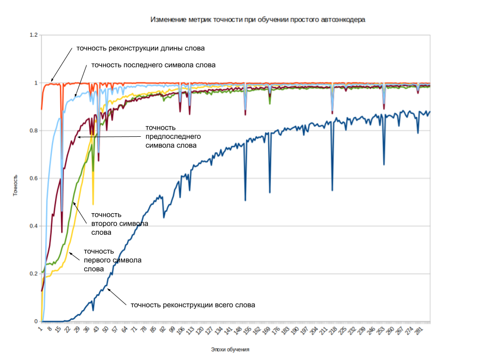
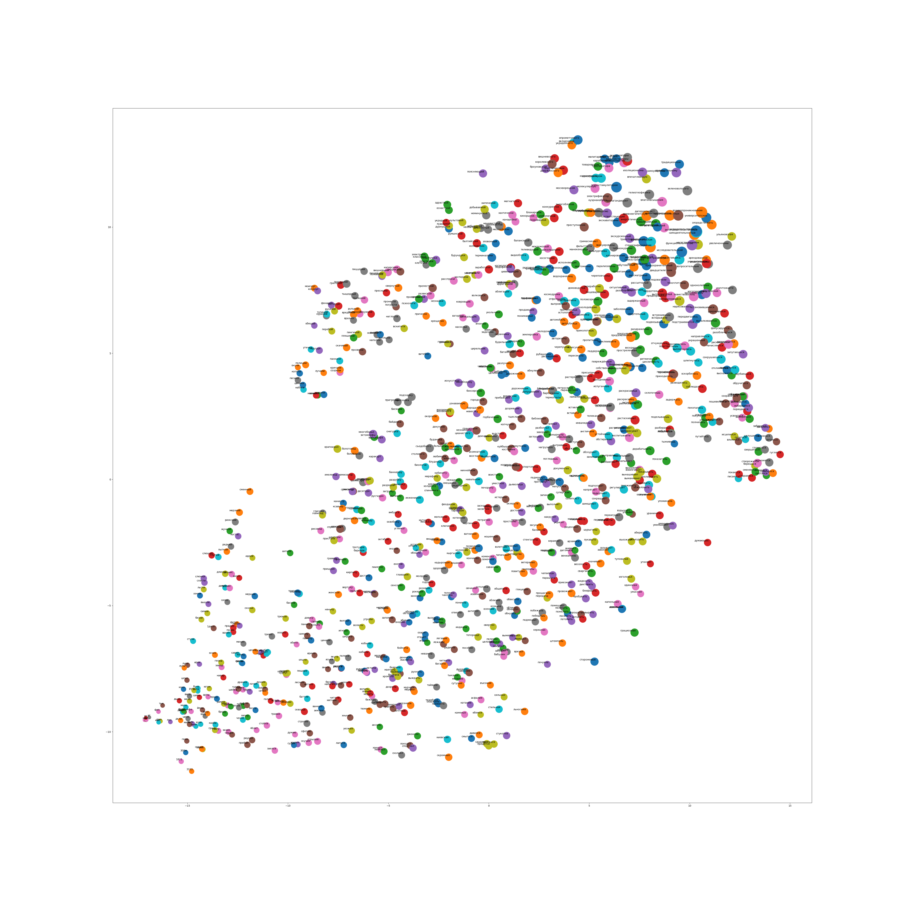
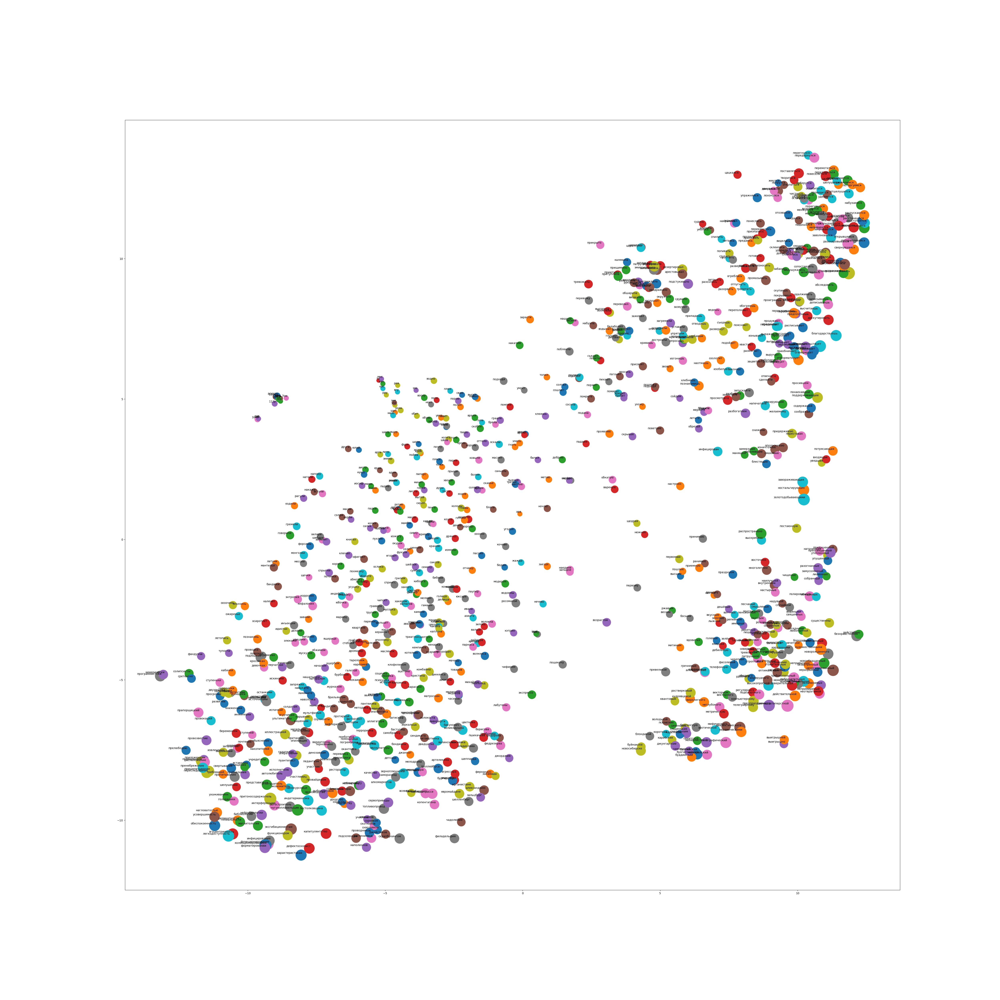
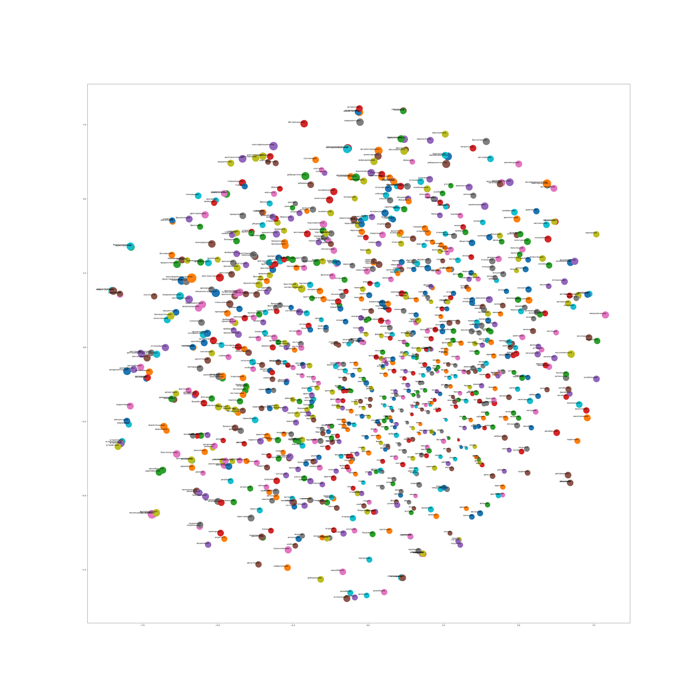
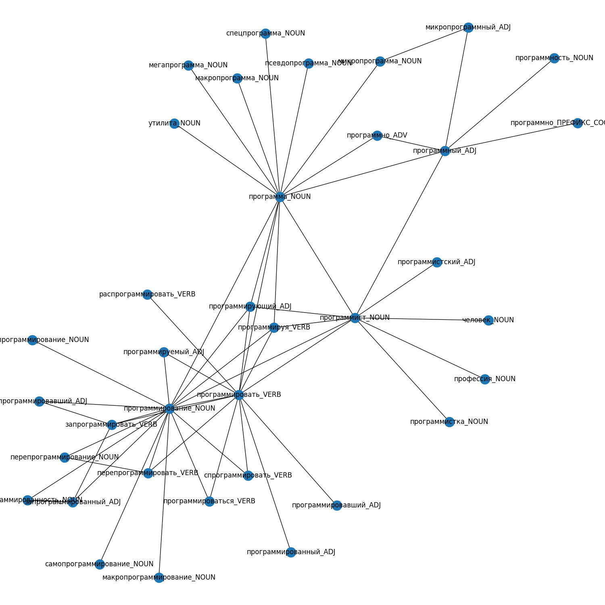

# Нейросетевые модели для векторизации слов

## Простой автоэнкодер

Тренировка модели автоэнкодера реализована на tensorflow (Keras) в [wordchar_simple_autoencoder.py](./py/wordchar_simple_autoencoder.py).  
Список слов, на котором учится модель, лежит в файле [words.txt](./data/words.txt).  


Модель с простой однонаправленной рекуррентной архитектурой в ходе обучения демонстрирует в ходе обучения вполне ожидаемую динамику
метрик точности:



Видно, что быстрее всего модель учится запоминать в латентном представлении длину слова. Последний символ слова восстанавливается лучше остальных, и так далее.


Готовая модель, обученная на этом датасете, уже лежит в каталоге tmp. Она используется в [experiments_with_simple_autoencoder.py](./py/experiments_with_simple_autoencoder.py).


### Интерполяция между двумя словами


Для двух заданных слов получаются эмбеддинги, затем делается 10 равных шагов от точки первого слова до второго. Получающиеся
точки декодируются обратно в символьное представление.

```
муха => моха => хохе => хоне => хлон => слон
работать => работатаь => рабофатаь => рабонатать => безоеьтаат => безнеьбиать => бездельиаать => бездельниааь => бездельничать
земной => земнойй => гемнойс => гомнойсй => гомнийси => комниески => космичекий => космически => космический
```

### Визуализация эмбеддингов с помощью t-SNE

Размер кружочков коррелирует с длиной слов. Взята 1000 случайных слов среди встречающихся в [sents.txt](./data/sents.txt)





### Поиск ближайших слов

```
123 => 193(0.975), 293(0.975), 12°(0.959), 192(0.957), 152(0.955), 181(0.939), 146(0.938), 170(0.936), см.(0.936), 197(0.933)
муха => зуха(0.983), мухе(0.973), руха(0.970), гуса(0.967), мова(0.963), леха(0.960), гоша(0.960), хуза(0.958), эрла(0.954), фука(0.953)
я => 4(0.976), }(0.947), д(0.910), ма(0.897), бо(0.870), ны(0.862), кю(0.856), 2й(0.851), ээ(0.828), фз(0.826)
голограмма => голограммах(0.982), волнограмма(0.962), докудрамах(0.941), диплограммам(0.940), кинодрамах(0.938), голобрюхие(0.934), голубеграмма(0.934), колораткам(0.933), дискограммы(0.932), говнороками(0.931)
среднегодовой => среднекраевой(0.962), средневосточной(0.950), кроненпробкой(0.942), скандализуемой(0.940), средневолжский(0.940), стенографируемой(0.940), предстартовой(0.940), фри-джазовый(0.937), кислотно-розовой(0.935), красно-черный(0.934)
крошечная => шишечная(0.959), крошечных(0.956), слиточная(0.944), карличная(0.944), сгущенная(0.944), сманенная(0.940), келейная(0.938), клеверная(0.937), приточная(0.936), тройчатная(0.936)
стоять => спреть(0.947), струан(0.941), троясь(0.935), строям(0.935), снуясь(0.932), сплоят(0.929), слышь(0.928), мриять(0.927), слоить(0.926), стоите(0.926)
прокумекав => прошуршав(0.943), постоматов(0.940), протухнув(0.940), прокрякав(0.938), проселков(0.937), промоушнов(0.936), прокаркав(0.935), просодемику(0.933), перепугав(0.932), продешевив(0.932)
```


## Модификация простого автоэнкодера дополнительными целями в ходе обучения

Можно усложнить процедуру обучения простого автоэнкодера, заставляя модель восстанавливать не только исходное символьное
представление слова, но и определять часть речи по латентному представлению. В качестве данных для обучения в этом случае используется
[размеченный корпус СинТагРус](https://github.com/UniversalDependencies/UD_Russian-SynTagRus), из которого используются поля ```form``` и ```upos```. 

Код обучения такого автоэнкодера доступен в файле [multitarget_simple_autoencoder.py](./py/multitarget_simple_autoencoder.py). Готовая модель
лежит в [tmp/multitarget_simple_autoencoder](./tmp/multitarget_simple_autoencoder).

Дополнительные грамматические цели побуждают модель встраивать в латентное представление немного больше информации.
Итоговое распределение слов в пространстве латентного представления:





## Вариационный автоэнкодер

 
Тренировка модели вариационного автоэнкодера реализована на tensorflow (Keras) в [wordchar_vae.py](./py/wordchar_vae.py).  
Готовая натренированная модель лежит в каталоге tmp/vae. Она используется в [experiments_with_vae.py](./py/experiments_with_vae.py). Эксперименты те же, что сделаны для
вышеописанной модели простого автоэнкодера.


### Интерполяция между двумя словами


```
муха => моха => хохе => хоне => хлон => слон
работать => работатаь => рабофатаь => рабонатать => безоеьтаат => безнеьбиать => бездельиаать => бездельниааь => бездельничать
земной => земнойй => гемнойс => гомнойсй => гомнийси => комниески => космичекий => космически => космический
```

### Визуализация эмбеддингов с помощью t-SNE




### Поиск ближайших слов

```
123 => 163(0.973), 128(0.971), 161(0.958), 1кг(0.945), 21%(0.939), 1225(0.934), 1320(0.927), 1614(0.923), 624(0.920), 1315(0.920)
муха => мока(0.973), хута(0.970), беха(0.970), экха(0.960), туба(0.959), кова(0.951), маса(0.950), мось(0.950), шота(0.949), туна(0.948)
я => )(0.961), бя(0.906), си(0.898), ге(0.896), пь(0.879), ги(0.874), ия(0.870), эу(0.869), ку(0.867), ло(0.865)
голограмма => декаграмма(0.943), колоризмам(0.943), аллограмма(0.942), флебограммах(0.938), микрограммы(0.930), автограмма(0.930), датаграмма(0.929), барограммам(0.928), маммограммы(0.927), голофанами(0.925)
среднегодовой => спинномозговой(0.962), краснодеревой(0.957), сверхфразовой(0.952), трёхцилиндровой(0.951), краснобровой(0.949), труднодоступной(0.948), прибрежноводной(0.943), краснофигурной(0.943), периклазовой(0.943), графитогазовой(0.942)
крошечная => крепежная(0.953), калеченая(0.951), срощенная(0.948), домоченная(0.946), сгрызенная(0.943), туалетная(0.942), сердешная(0.941), заплечная(0.941), приветная(0.939), созвучная(0.938)
стоять => сдоюсь(0.953), сныть(0.950), ссуть(0.943), спорят(0.941), стоян(0.940), помять(0.935), понять(0.933), спутан(0.931), сьесть(0.929), ссовать(0.925)
прокумекав => примолкав(0.940), прошляков(0.938), постумиева(0.937), проктологов(0.935), трёхлетков(0.934), чистоусов(0.932), термосесов(0.932), чарушников(0.930), питомчиков(0.929), протопотав(0.929)
```


## Эмбеддинги слов в тезаурусе (wordnet-графе)

Код [thesaurus_embeddings.py](./py/thesaurus_embeddings.py) обучает word2vec модель на данных, которые
получаются из wordnet-графа. Этот граф взят из проекта [Грамматического Словаря](https://github.com/Koziev/GrammarEngine)
и содержит примерно такие данные:




Данные для обучения word2vec получаются случайными блужданиями по этому графу с равновероятным переходом по ребрам. Получающиеся
цепочки переходов "скармливаются" в gensim-модель. После обучения можно поискать ближайшие слова:

```
кошка_NOUN => киса_NOUN(0.994), киска_NOUN(0.993), котенок_NOUN(0.991), кот_NOUN(0.991), котеночек_NOUN(0.991)
сухость_NOUN => черствый_ADJ(0.955), суховатый_ADJ(0.949), суховатость_NOUN(0.946), бездушность_NOUN(0.940), бездушие_NOUN(0.939)
бодрствовать_VERB => бодрствование_NOUN(0.992), полубодрствующий_ADJ(0.985), пободрствовать_VERB(0.985), бодрствующий_ADJ(0.984), пободрствовав_VERB(0.979)
золотистый_ADJ => золотистенький_ADJ(0.992), ультрамарин_NOUN(0.982), двухцветный_ADJ(0.980), мрамор_NOUN(0.978), цвет_NOUN(0.977)
```


